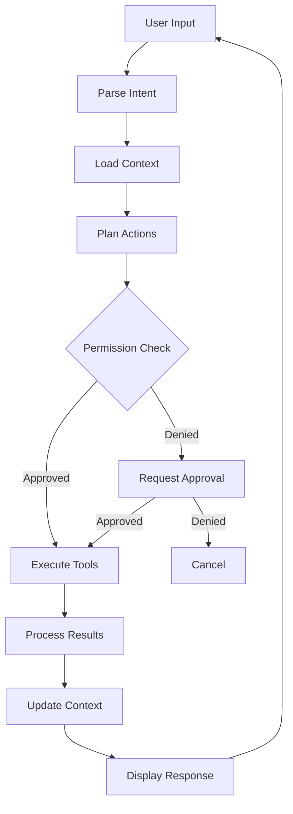

Claude Code is built on several key concepts that work together to provide intelligent, context-aware coding assistance. Understanding these concepts will help you use Claude Code more effectively.

## Core Architecture

Claude Code combines multiple technologies to understand and modify your codebase:

<CardGroup cols={2}>
  <Card title="Natural Language Interface" icon="comments" href="/concepts/natural-language">
    Conversational commands that understand intent and context
  </Card>
  
  <Card title="Specialized Agents" icon="users" href="/concepts/agents">
    Background workers for complex analysis and code generation
  </Card>
  
  <Card title="Codebase Understanding" icon="book" href="/concepts/codebase-understanding">
    Deep analysis of code structure, patterns, and relationships
  </Card>
  
  <Card title="Tool Execution" icon="wrench">
    Safe, controlled execution of file operations and shell commands
  </Card>
</CardGroup>

## How Claude Code Works

When you interact with Claude Code, several systems work together:

<Steps>
  <Step title="Input Processing">
    Your natural language request is parsed to understand intent, referenced files, and required actions.
  </Step>
  
  <Step title="Context Assembly">
    Claude Code gathers relevant context from:
    - Conversation history
    - Referenced files (@-mentions)
    - Project structure and patterns
    - Git history and status
    - Custom configuration (CLAUDE.md)
  </Step>
  
  <Step title="Intelligent Planning">
    Based on your request and context, Claude determines:
    - Which files need to be read
    - What changes to make
    - Which tools to use
    - Whether to launch specialized agents
  </Step>
  
  <Step title="Permission Checking">
    Before executing operations, Claude Code:
    - Checks permission rules
    - Applies security policies
    - Requests approval for new operations
    - Validates against allowed tools
  </Step>
  
  <Step title="Execution">
    Approved operations are executed using specialized tools:
    - **Read**: Load file contents
    - **Edit**: Make targeted changes
    - **Write**: Create new files
    - **Bash**: Run shell commands
    - **Grep/Glob**: Search code
  </Step>
  
  <Step title="Result Processing">
    Execution results are:
    - Displayed with syntax highlighting
    - Added to conversation context
    - Used to inform next steps
    - Stored in session history
  </Step>
</Steps>

## Key Components

### 1. Conversation Context

Claude Code maintains conversation context throughout your session:

- **Message History**: All previous messages and responses
- **Tool Results**: Outputs from file reads, searches, and commands
- **File References**: Files mentioned with @
- **Session State**: Current working directory, git branch, permissions

**Context Window**: Claude Code uses Claude 4.6 models with large context windows (up to 1M tokens for Sonnet 4.6). When approaching limits, use `/compact` to summarize.

### 2. Tool System

Claude Code uses specialized tools for different operations:

| Tool | Purpose | Example |
|------|---------|--------|
| **Read** | Load file contents | Read configuration files, source code |
| **Edit** | Modify existing files | Fix bugs, refactor code |
| **Write** | Create new files | Generate new modules, tests |
| **Bash** | Execute shell commands | Run tests, git operations |
| **Glob** | Find files by pattern | Locate all TypeScript files |
| **Grep** | Search file contents | Find function usages |
| **WebFetch** | Retrieve web content | Read documentation |
| **WebSearch** | Search the web | Find solutions, examples |
| **Task** | Launch background agents | Complex analysis, code exploration |

<Note>
  Tools are executed with safety checks. File operations are sandboxed, and bash commands can be restricted based on security policies.
</Note>

### 3. Permission System

Granular control over what Claude Code can do:

**Permission Levels**:
- **Allow**: Automatically approved
- **Ask**: Prompts for approval
- **Deny**: Blocked

**Scopes**:
- **Session**: This conversation only
- **Project**: All sessions in this project
- **User**: All projects globally

**Rule Matching**: Permissions support wildcards and patterns:
```json
{
  "permissions": {
    "allow": [
      "Bash(git status:*)",
      "Bash(npm test:*)",
      "Read",
      "Grep"
    ],
    "ask": [
      "Bash(git push:*)",
      "Write",
      "Edit"
    ],
    "deny": [
      "Bash(rm -rf:*)",
      "WebFetch"
    ]
  }
}
```

### 4. Plugin System

Extend functionality with plugins that provide:

**Custom Commands**: Slash commands for specific workflows
```markdown
---
description: Create a git commit
allowed-tools: Bash(git:*)
---
Create a commit based on current changes...
```

**Specialized Agents**: Background workers for complex tasks
```markdown
---
description: Explore code execution paths
model: claude-sonnet-4.6
---
Trace through code comprehensively...
```

**Event Hooks**: React to events like tool execution or session start
```json
{
  "events": ["PreToolUse", "PostToolUse"],
  "command": "./validate.sh"
}
```

**MCP Servers**: Connect external tools and data sources
```json
{
  "mcpServers": {
    "github": {
      "command": "npx",
      "args": ["-y", "@modelcontextprotocol/server-github"]
    }
  }
}
```

### 5. Session Management

Sessions preserve conversation state:

**Auto-save**: Conversations are automatically saved

**Resume**: Continue previous sessions:
```bash
claude --resume
claude --resume session-id
```

**Compaction**: Summarize long conversations to free context:
```
> /compact
```

**Forking**: Branch from any message to explore alternatives:
```
> /fork
```

### 6. Model Selection

Claude Code supports multiple models:

| Model | Best For | Context Window |
|-------|----------|----------------|
| **Sonnet 4.6** | General coding, fast responses | 200K (1M with flag) |
| **Opus 4.6** | Complex tasks, deep reasoning | 200K (1M with flag) |
| **Sonnet 4.5** | Legacy support | 200K |

**Fast Mode**: Available for Opus 4.6, trades some accuracy for speed:
```
> /fast
```

**Effort Levels**: Control thinking depth for complex tasks:
```
> /model
# Select Opus 4.6 and choose effort level
```

## Advanced Concepts

### Prompt Caching

Claude Code uses prompt caching to reduce latency and costs:

- **System Prompts**: Cached across messages
- **Tool Definitions**: Cached when unchanged
- **Large Context**: Frequently accessed files cached

**Cache Hit Rates**: Typically 80%+ in active sessions

### Context Management

Optimizing context usage:

**Efficient File Loading**:
- PDFs: Load specific page ranges with `pages` parameter
- Large files: Collapsed summaries with expand option
- Binary files: Automatic exclusion

**Search Tools**:
- **Glob**: Find files by pattern (fast, minimal context)
- **Grep**: Search contents (returns matches, not full files)
- **MCP Search**: Defer tool discovery until needed

**Compaction**: Automatic summarization when nearing limits

### Security Model

**Sandbox Mode**: Restrict bash commands to sandboxed environment:
```json
{
  "sandbox": {
    "network": {
      "allowedDomains": ["api.github.com"],
      "allowLocalBinding": false
    },
    "excludedCommands": ["git", "npm"]
  }
}
```

**Managed Settings**: Enterprise policies that users cannot override:
```json
{
  "allowManagedPermissionRulesOnly": true,
  "allowManagedHooksOnly": true,
  "strictKnownMarketplaces": []
}
```

**Path Safety**: Automatic validation of file paths:
- Gitignored files: Warnings
- Outside project: Blocked by default
- Sensitive files (.env): Extra confirmation

## Data Flow

Understanding how data flows through Claude Code:



## Best Practices

<Tip>
  **Use @-mentions**: Reference specific files to provide precise context and reduce token usage.
</Tip>

<Tip>
  **Leverage agents**: For complex analysis, launch specialized agents instead of asking Claude to do everything.
</Tip>

<Tip>
  **Set up permissions**: Create rules for frequently used operations to streamline workflow.
</Tip>

<Tip>
  **Monitor context**: Check `/context` periodically and compact when needed to maintain performance.
</Tip>

<Tip>
  **Use CLAUDE.md**: Document project conventions in `.claude/CLAUDE.md` for consistent behavior.
</Tip>

## Learn More

Dive deeper into specific concepts:

<CardGroup cols={3}>
  <Card title="Natural Language" icon="comments" href="/concepts/natural-language">
    How Claude understands your requests
  </Card>
  
  <Card title="Agents" icon="users" href="/concepts/agents">
    Background workers and task management
  </Card>
  
  <Card title="Codebase Understanding" icon="book" href="/concepts/codebase-understanding">
    How Claude analyzes your code
  </Card>
</CardGroup>